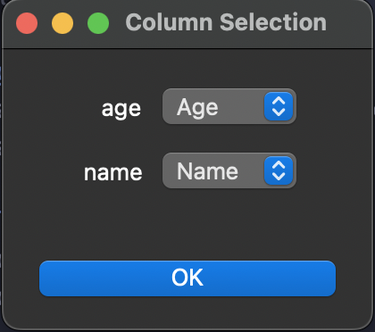

### Installation:

`pip install -r reqirements.txt`

### Running the program:

`python3 gui.py`

### Screenshots

### File selection form:

Template: a docx file with template variables

Workbook: an Excel workbook with the data

Sheet: number of the sheet which contains the data

### Column selection form:

for every template variable the corresponding data column must be choosen

